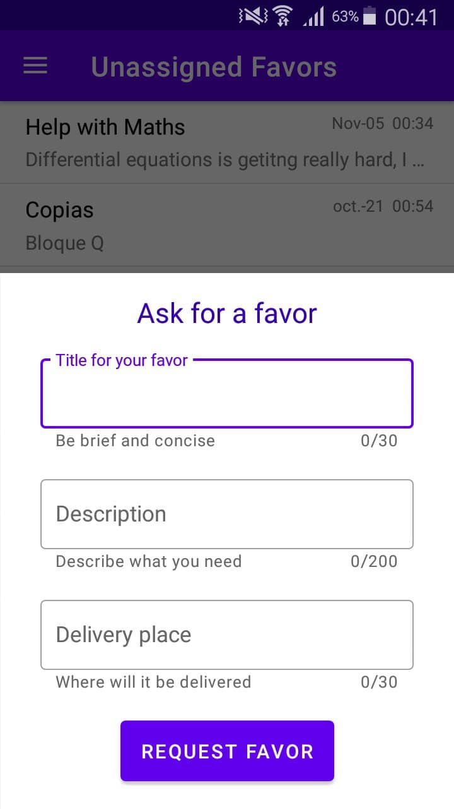
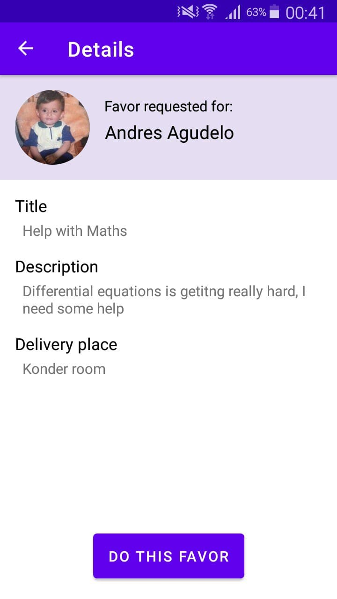
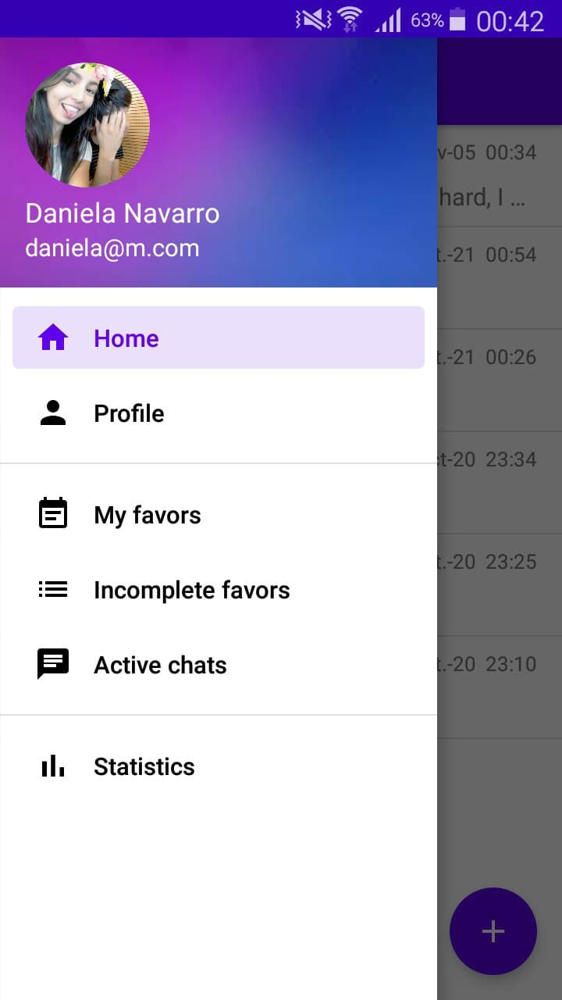
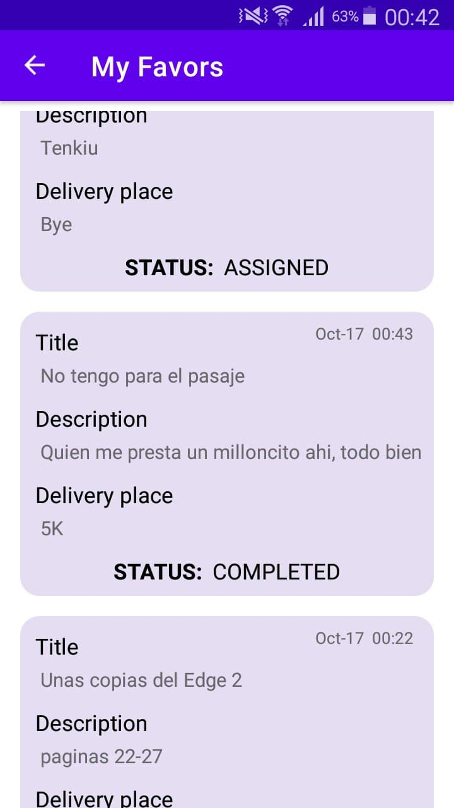
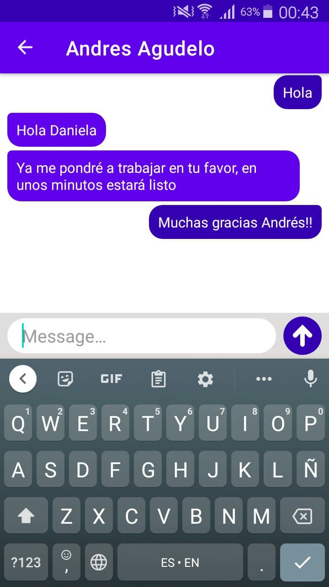
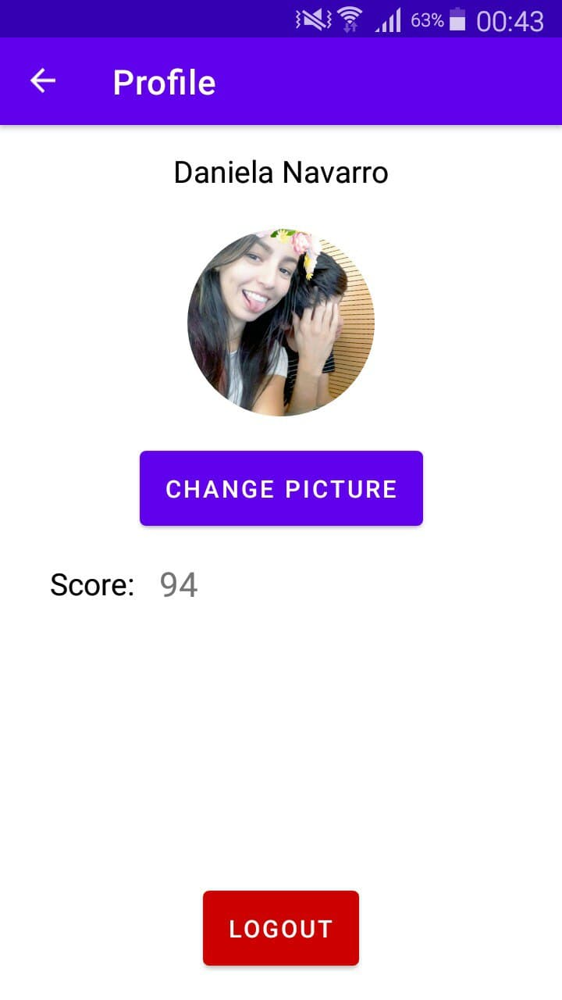

# UniFavores
Android project for requesting and making favors in campus. It's just an university project that goes beyond the requested features by the professor.

## Features
New users can ask for a favor (let's say copies, make an urgent queue at the restaurant, make a reservation, so on). Main screen is list of favors that other users have requested and no one has taken to do it yet.

 

When you ask for a favor, you lose your 2 points, so you will not be able to ask for more favor... at least you start making favors and earn 2 points per each ;)
You'll also get notified when someone start making a favor you requested.

In _Active Chats_, you'll be able to chat (notifications included) with people you're making any favor, or the ones making you any favor.
You'll also be able to check your Favors status in _My Favors_, see if they're assigned, unassigned, completed.

 

If a favor is assigned and you tap it, you can go the chat with the one making it, if a favor is unassigned you'll be able to delete it (you won't recover any points).

 

Project contains sensitive files that no project should contain, but it's still a development phase and something just about learning, not a business, so you only need to clone, run, and everything will work.

## Contributing
Pull requests are welcome. For major changes, please open an issue first to discuss what you would like to change.

## License
[MIT](https://choosealicense.com/licenses/mit/)

